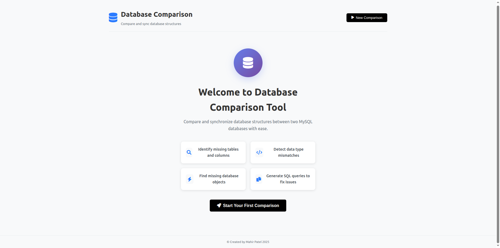
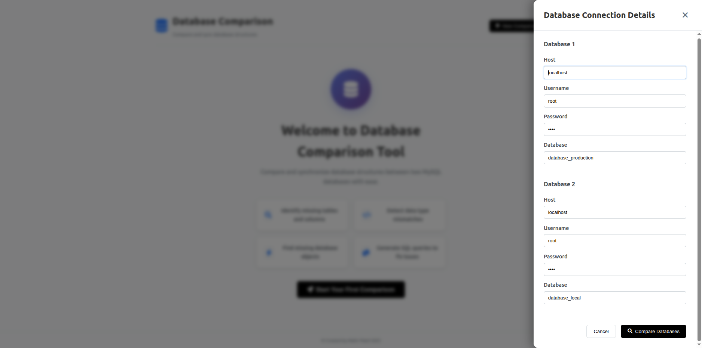
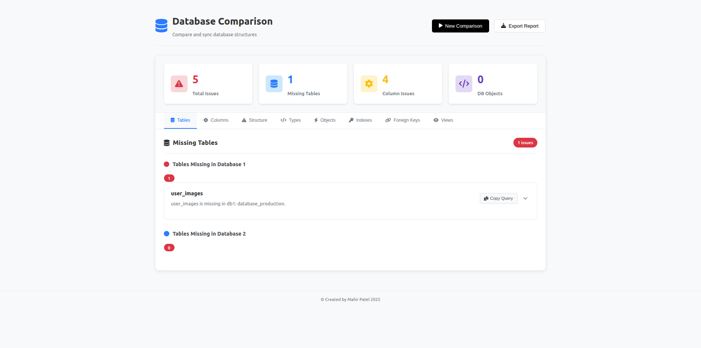
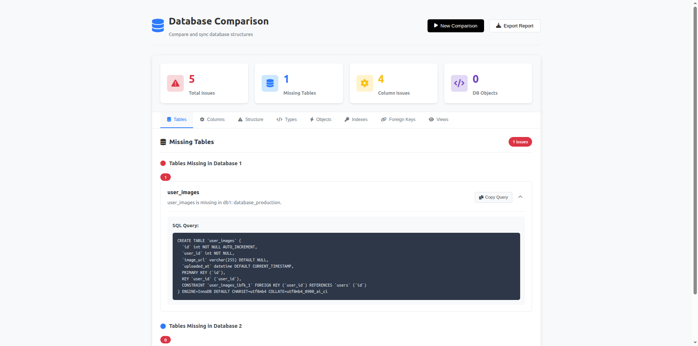

# 🗄️ DatabaseDiff

**Compare and synchronize MySQL database structures with ease**

[](https://github.com/MahirPatel/DatabaseDiff)
[](https://php.net/)
[](https://mysql.com/)
[](LICENSE)

## 📋 Overview

DatabaseDiff is a powerful web-based tool that compares two MySQL databases and identifies structural differences between them. It provides comprehensive analysis of database schemas and generates SQL queries to synchronize the differences, making it perfect for database administrators, developers, and DevOps teams.

## ✨ Features

- 🔍 **Complete Schema Comparison** - Analyze tables, columns, indexes, foreign keys, views, and database objects
- 📊 **Visual Dashboard** - Interactive interface with summary cards and detailed issue breakdown
- 🛠️ **SQL Query Generation** - Automatic generation of synchronization queries for all detected differences
- 📁 **Comprehensive Analysis** - Compare tables, columns, data types, indexes, foreign keys, views, functions, procedures, events, and triggers
- 📋 **Export Reports** - Generate detailed comparison reports for documentation
- 💾 **Connection Management** - Save and reuse database connection details
- 🎯 **One-Click Copy** - Copy SQL queries with a single click
- 📱 **Responsive Design** - Works seamlessly on desktop and mobile devices

## 🖼️ Screenshots

### Main Interface

*Clean welcome screen with feature highlights and easy-to-use interface*

### Database Connection Setup

*Simple form to configure connections to both databases*

### Comparison Results

*Comprehensive dashboard showing all detected differences with summary statistics*

### Detailed Issue View

*Expandable cards showing SQL queries and detailed information for each issue*

## 🚀 Quick Start

### Requirements

- **PHP**: 5.6 or above (stable version recommended)
- **MySQL**: Stable version
- **Web Server**: Any server that supports PHP (Apache/Nginx)
- **Browser**: Any modern stable browser

### Installation

1. **Clone the repository**
   ```bash
   # Using HTTPS
   git clone https://github.com/MahirPatel/DatabaseDiff.git
   
   # Using SSH
   git clone git@github.com:MahirPatel/DatabaseDiff.git
   
   # Using GitHub CLI
   gh repo clone MahirPatel/DatabaseDiff
   ```

2. **Deploy to web server**
   ```bash
   # For Linux (move to html directory)
   sudo mv DatabaseDiff /var/www/html/
   
   # For Windows (move to htdocs directory)
   move DatabaseDiff C:\xampp\htdocs\
   ```

3. **Set permissions** (Linux only)
   ```bash
   sudo chown -R www-data:www-data /var/www/html/DatabaseDiff
   sudo chmod -R 755 /var/www/html/DatabaseDiff
   ```

4. **Access the application**
   ```
   http://localhost/DatabaseDiff
   ```

## 📖 Usage

### Step 1: Access the Application
Open your web browser and navigate to the DatabaseDiff installation URL.

### Step 2: Configure Database Connections
1. Click "New Comparison" or "Start Your First Comparison"
2. Fill in the connection details for both databases:
   - **Host**: Database server hostname (e.g., localhost)
   - **Username**: Database username
   - **Password**: Database password
   - **Database**: Database name to compare

### Step 3: Run Comparison
1. Click "Compare Databases" to start the analysis
2. Wait for the comparison to complete
3. Review the results in the interactive dashboard

### Step 4: Analyze Results
- **Summary Cards**: View total issues, missing tables, column issues, and database objects
- **Tabbed Navigation**: Browse different categories of issues
- **Issue Details**: Expand cards to view SQL queries and detailed information
- **Copy Queries**: Use the "Copy Query" button to copy SQL statements

### Step 5: Export Report
Click "Export Report" to download a comprehensive text report of all findings.

## 🔧 Database Permissions

Ensure that the database user credentials have proper privileges to access database structure information:

```sql
-- Required permissions for comparison
GRANT SELECT ON information_schema.* TO 'username'@'host';
GRANT SHOW DATABASES ON *.* TO 'username'@'host';
GRANT SHOW VIEW ON database_name.* TO 'username'@'host';
```

## 🏗️ Architecture

### Frontend
- **HTML5**: Modern semantic markup
- **CSS3**: Responsive design with Flexbox/Grid
- **JavaScript**: jQuery-based interactions and AJAX
- **Font Awesome**: Professional iconography

### Backend
- **PHP**: RESTful API with MySQLi
- **MySQL**: Database introspection and analysis
- **JSON**: Structured data exchange format

### File Structure
```
DatabaseDiff/
├── index.html              # Main application interface
├── css/
│   └── style.css           # Application styles
├── js/
│   └── app.js              # Frontend logic and interactions
├── api_v1/
│   └── dbdiff.php          # Backend API for database comparison
└── README.md               # Project documentation
```

## 🔌 API Documentation

### Endpoint: `/api_v1/dbdiff.php`

**Method**: `POST`

**Request Format**:
```json
{
  "db1": {
    "connection_host": "localhost",
    "connection_username": "root",
    "connection_password": "password",
    "connection_database": "database1"
  },
  "db2": {
    "connection_host": "localhost",
    "connection_username": "root",
    "connection_password": "password",
    "connection_database": "database2"
  }
}
```

**Response Format**:
```json
{
  "status": "1",
  "message": "database compared successfully",
  "data": {
    "missing_table": {"db1": [], "db2": []},
    "missing_column": {"db1": {}, "db2": {}},
    "structure_missmatch_table": [],
    "structure_missmatch_table_column": {},
    "missing_index": {"db1": [], "db2": []},
    "missing_foreign_key": {"db1": [], "db2": []},
    "missing_view": {"db1": [], "db2": []},
    "missing_function": {"db1": [], "db2": []},
    "missing_procedure": {"db1": [], "db2": []},
    "missing_event": {"db1": [], "db2": []},
    "missing_trigger": {"db1": [], "db2": []}
  }
}
```

## ⚙️ Configuration

### Security Settings
- The application can be accessed from any URL or host-based connection
- Suitable for both production and local environments
- Ensure proper database user permissions for security

### Performance Notes
- **Scope**: Compares database structure only (not data)
- **Limitations**: Designed for schema comparison, not data migration
- **Optimization**: Works efficiently with databases of any size

## 🛠️ Troubleshooting

### Common Issues

**Connection Failed**
- Verify database credentials
- Check if MySQL server is running
- Ensure proper network connectivity

**Permission Denied**
- Grant necessary database privileges
- Check user permissions on both databases

**Empty Results**
- Verify database names are correct
- Ensure databases contain tables/objects
- Check for case sensitivity in database names

**Browser Compatibility**
- Use modern browsers (Chrome, Firefox, Safari, Edge)
- Enable JavaScript
- Clear browser cache if issues persist

## 🤝 Contributing

We welcome contributions from the community! Here's how you can help:

### Getting Started
1. **Fork the repository** to your GitHub account
2. **Clone your fork** locally:
   ```bash
   git clone https://github.com/MahirPatel/DatabaseDiff.git
   ```
3. **Create a feature branch**:
   ```bash
   git checkout -b feature/your-feature-name
   ```

### Development Guidelines
- Follow existing code patterns and formatting
- Test your changes with sample databases
- Add comments for complex logic
- Ensure cross-browser compatibility

### Contribution Process
1. **Make your changes** in your feature branch
2. **Test thoroughly** with different database scenarios
3. **Commit your changes** with clear, descriptive messages
4. **Push to your fork**:
   ```bash
   git push origin feature/your-feature-name
   ```
5. **Create a Pull Request** to the main repository

### Code Standards
- **PHP**: Follow existing patterns in `api_v1/dbdiff.php`
- **JavaScript**: Maintain jQuery coding style in `js/app.js`
- **CSS**: Use consistent naming and organization
- **HTML**: Keep semantic structure and accessibility in mind

### Branch Management
- **Fork Freedom**: Use your fork for any modifications or personal projects
- **Protected Master**: Only approved pull requests are merged to master
- **Quality Control**: All contributions are reviewed before integration

### What We're Looking For
- Bug fixes and improvements
- New database object support
- UI/UX enhancements
- Performance optimizations
- Documentation improvements

## 📄 License

This project is licensed under the MIT License - see the [LICENSE](LICENSE) file for details.

## 🆕 Changelog

### Version 1.0.0 (2025-01-XX)
- Initial release
- Complete database structure comparison
- Support for tables, columns, indexes, foreign keys, views
- Database objects comparison (functions, procedures, events, triggers)
- Interactive web interface
- SQL query generation
- Export functionality
- Responsive design

## 📞 Support

- **Issues**: [GitHub Issues](https://github.com/MahirPatel/DatabaseDiff/issues)
- **Email**: mahirpatel9765@gmail.com

## 🙏 Acknowledgments

- Created by **Mahir Patel** (2025)
- Inspired by the need for efficient database comparison tools

---

**Made with ❤️ for the developer community**

*DatabaseDiff - Making database comparisons simple and efficient*